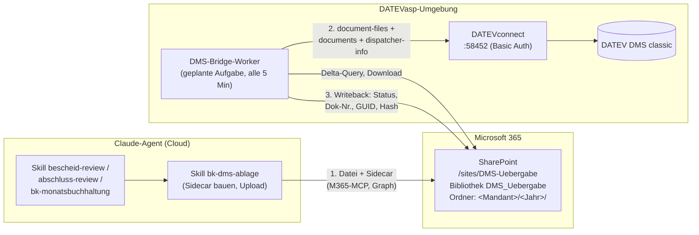

# Konzept: Automatische Dokumentenablage SharePoint → DATEV DMS

**Stand:** 2026-08-07 · **Status:** Entwurf zur Abstimmung · **Autor:** Claude-Agent mit Oliver Burchardt

## 1. Ausgangslage und Ziel

Heute erzeugen Mitarbeiter mit dem Claude-Agenten Dokumente (Bescheidreview-Arbeitspapiere, FIBU-Prüfprotokolle, Abschluss-Reviews u. a.), laden sie herunter und legen sie manuell im DATEV DMS ab. Dieser Medienbruch entfällt:

1. Der **Agent** legt das fertige Dokument mit einer Metadaten-Begleitdatei in der SharePoint-Übergabebibliothek ab (Skill `bk-dms-ablage`).
2. Die **DMS-Bridge** (Worker in der DATEVasp-Umgebung) erkennt neue Dokumente, löst den Mandanten auf und legt das Dokument über die DATEVconnect-DMS-API (`/datev/api/dms/v2`) im richtigen Bereich/Ordner/Register ab.
3. Der Ablage-Erfolg (DMS-Dokumentnummer, Zeitpunkt, Prüfsumme) wird an das SharePoint-Item **zurückgeschrieben** — jeder sieht in der Bibliothek, was im DMS angekommen ist.

Es gibt keine Diskussion mehr, ob Unterlagen sauber abgelegt sind: Die Bibliothek ist die Übergabestelle mit Statusanzeige, das DMS die revisionssichere Akte.

## 2. Architektur

**Metadatenfluss:** Führend ist die JSON-Begleitdatei `<Datei>.dms.json` (Kontrakt: `bridge-worker/schemas/uebergabe.schema.json`, Version 1.0) mit Mandantennummer (5-stellig), Jahr, Dokumenttyp, Beschreibung, SHA-256, Quell-Skill. Die Bridge validiert das Sidecar, spiegelt die Werte in die SharePoint-Spalten (menschenlesbar, filterbar) und führt die Statusmaschine `Neu → InVerarbeitung → Abgelegt | Fehler` allein.

> **Warum eine Begleitdatei statt direkt gesetzter Spalten?** Der Microsoft-365-Connector des Agenten kann Dateien hochladen, aber keine Listenspalten setzen. Die Begleitdatei ist zudem prüfbar (Schema + Prüfsumme) und macht den Kontrakt technologieunabhängig — jede spätere Bridge-Implementierung (Klardaten, Power Automate) liest denselben Kontrakt. Die Spalten sind trotzdem befüllt, nur eben durch die Bridge. *(Abweichung von der ursprünglichen Idee „Agent setzt Spalten“ — am 2026-08-07 mit O. Burchardt abgestimmt.)*

## 3. Brückenvarianten im Vergleich

| Kriterium | **(a) Lokaler Worker im ASP** ✅ Empfehlung | (b) Power Automate + On-Prem-Gateway | (c) Klardaten-Write-Erweiterung |
|---|---|---|---|
| Zeit bis Pilot | Wochen (ASP-Ticket: geplante Aufgabe + ausgehendes HTTPS) | Monate (Gateway in der Terminalserver-Farm, Custom Connector, Lizenzen) | unbestimmt (Fremd-Roadmap) |
| Fehlerbehandlung / Idempotenz | voll steuerbar (eigener Ledger, Statusmaschine, Retries) | schwach: der zweistufige, transaktionale Ablauf `document-files → documents → Writeback` passt nicht zu Flow-Retries | voll, aber beim Anbieter |
| ASP-Koordination | gering (1 Task, 1 Service-Konto) | hoch (Gateway-Dienst dauerhaft installieren und patchen) | keine — läuft extern; die Konnektivität zu DATEVconnect besteht nachweislich bereits (lesender Klardaten-MCP) |
| Betrieb | Kanzlei/IT-Dienstleister, Single-File-Deployment | Microsoft-Cloud + Gateway-Pflege | Anbieter |
| Kosten | keine Lizenzkosten | Power-Automate-Premium | Verhandlungssache |
| GoBD-Audit-Trail | eigenes JSONL-Log (10 J.) + DMS-Revisionshistorie | Flow-Historie mit begrenzter Aufbewahrung | abhängig vom Anbieter |

**Empfehlung:** **(a) sofort umsetzen** — der Worker in diesem Repo ist zugleich die ausführbare Spezifikation für (c). **Parallel (c) beim Klardaten-Anbieter anfragen**: Deren MCP erreicht das DATEVconnect der Kanzlei bereits von außen; mit einem Schreib-Endpunkt könnte der Agent mittelfristig direkt ins DMS abliegen, und im ASP müsste gar nichts betrieben werden. **(b) wird verworfen** (Aufwand/Nutzen, siehe Tabelle).

## 4. Entscheidungen

| # | Entscheidung | Begründung |
|---|---|---|
| E1 | Worker als **geplante Aufgabe** (alle 5 Min, One-Shot mit Lockfile), kein Windows-Dienst | minimale ASP-Freigabehürde; Latenz ≤ 5 Min ist fachlich irrelevant |
| E2 | **Graph-Delta-Query** statt Webhooks | Webhooks bräuchten einen öffentlich erreichbaren Endpunkt im ASP; Delta erkennt zudem In-Place-Updates bereits abgelegter Dateien |
| E3 | **JSON-Sidecar** als führender Metadaten-Kontrakt, Spalten als Spiegel | s. Kasten in Abschnitt 2 |
| E4 | **1-MiB-Grenze des M365-Connectors**: ≤ 900 KiB Direktupload; größere Dateien über die **Manuell-Lane** (`binary_delivery: manual` — Agent lädt nur das Sidecar, nennt dem Nutzer den Zielordner, die Bridge wartet auf die Datei und verifiziert die Prüfsumme) | kein Chunking-Hack; die Review-Workbooks liegen typisch bei 50–300 KiB |
| E5 | **Fortschreibung** (z. B. Bescheidreview je Bescheidfamilie): `update_strategy: version` — neue Datei-Revision am bestehenden DMS-Dokument mit `revision_comment` + `dispatcher-information`; bei API-Ablehnung Fallback `new_document` („Aktualisierung, ersetzt Dokument …“). **Niemals löschen.** | DMS führt die Revisionshistorie; keine Dubletten; GoBD |
| E6 | Mandantennummer → GUID **zur Laufzeit** über `/master-data/v1/clients` (eindeutiger Treffer Pflicht); **keine `property_templates`** in v1 | GUIDs nie raten/cachen (Konvention aller Kanzlei-Skills); Property-Templates überschreiben gesetzte Metadaten unkontrollierbar — Testpunkt im Pilot, ob die Kanzlei Pflicht-Templates erzwingt |

## 5. Validierungsstand (2026-08-07, via Klardaten-MCP gegen die echte DMS-Instanz)

- Ablagestruktur bestätigt: Bereich **„Mandanten“** (Domain 1) mit Ordnern **„Steuerakte“** (u. a. Register „Steuerbescheide“, „Arbeitspapiere zu Steuererklärungen“, „Rechtsbehelfe“), **„Jahresabschluss/Bilanz“** (u. a. „Arbeitspapiere zum Jahresabschluss“), **„Finanzbuchhaltung“** (u. a. „Arbeitspapiere FiBu“, „Unterlagen zur Mandantenabstimmung“). Die konkreten IDs stehen in `bridge-worker/mapping.example.yaml` und sind vor Produktivbetrieb gegen `GET /dms/v2/domains` zu verifizieren.
- Status-Katalog für Dokumentklasse 1 bestätigt (u. a. „offen“, „Zur Freigabe“, „Freigegeben“, „In Bearbeitung“). Default der Bridge: „offen“; je Dokumenttyp übersteuerbar (z. B. „Zur Freigabe“ für Review-Arbeitspapiere).
- Mandantennummern sind 5-stellig; der Ablauf Nummer → GUID über die Master-Data-API wurde erfolgreich geprobt.
- Der M365-Connector kann in Unterordner der Bibliothek hochladen (parentItemId); das genaue Verhalten wird im Pilot verifiziert — Fallback: flacher Upload, die Bridge verschiebt nach `<Mandant>/<Jahr>/`.

## 6. GoBD und Sicherheit

- **Kein Löschen, kein Überschreiben im DMS**: Fortschreibungen erzeugen Revisionen oder neue Dokumente; die DMS-Revisionshistorie bleibt vollständig. Die Bridge besitzt keine Delete-Rechte-Nutzung (Endpunkte werden nicht implementiert).
- **Audit-Trail**: jede API-Interaktion als JSONL-Zeile (Zeitstempel UTC, System, Methode, URL, Status, Kontext), tagesweise Dateien, nur anhängend, Aufbewahrung 10 Jahre. Zusätzlich `dispatcher-information` im DMS je Ablage/Fortschreibung.
- **Idempotenz**: SHA-256 der Datei im Sidecar + Ledger (SharePoint-Item ↔ DMS-GUID ↔ Hash). Kein Stand wird doppelt abgelegt; Manipulation zwischen Sidecar und Datei fällt durch Hash-Abgleich auf.
- **Least Privilege**: Entra-App mit `Sites.Selected` nur auf `/sites/DMS-Uebergabe`; DATEVconnect-Service-Benutzer nur mit DMS-Schreibrecht auf die Mandanten-Bereiche; Geheimnisse im Windows Credential Manager, nie in Konfigurationsdateien.
- **Personenbezug/DSGVO**: Die Übergabebibliothek enthält Mandantendaten → Zugriff auf den Mitarbeiterkreis beschränken, Versionierung an, Papierkorb-Standardverhalten (Bibliothek ist Durchgangsstation, das Archiv ist das DMS).

## 7. Offene Punkte

**An den ASP-Provider (Ticket vor Phase 0):**
1. Host mit Netzzugang zu DATEVconnect (`:58452`) und ausgehendem HTTPS zu `login.microsoftonline.com` + `graph.microsoft.com`?
2. Freigabe: geplante Aufgabe unter Service-Konto; Python-Umgebung oder signierte EXE?
3. DATEVconnect: Hostname/Port/Zertifikat der Instanz; Basic-Auth-Service-Benutzer.
4. Update-Prozess für die Worker-Binary (wer spielt Updates ein?).

**An den Klardaten-Anbieter:**
5. Roadmap schreibende DMS-Endpunkte (document-files, documents, structure-item-Update, dispatcher-information)?
6. Bereitschaft, `uebergabe.schema.json` + Worker-Logik als Spezifikation zu übernehmen? Konditionen?

**DATEV / intern:**
7. Lizenz/Rechte des DATEVconnect-Benutzers für schreibendes DMS (bisher nur lesend nachgewiesen).
8. Testmandant im DMS classic für Phase 1.
9. Erzwungene Property-Templates im Kanzlei-DMS ja/nein (E6).
10. Fachliche Festlegung je Dokumenttyp: Ziel-Register und Status (Vorschlag in `mapping.example.yaml`).

## 8. Dokumente dieses Pakets

| Datei | Inhalt |
|---|---|
| `KONZEPT.md` | dieses Dokument |
| `sharepoint/BIBLIOTHEK_SPEZIFIKATION.md` | Site, Bibliothek, Spalten, Ansichten, Berechtigungen |
| `sharepoint/provisioning/` | PnP-Provisionierung + manuelle Einrichtungs-Checkliste |
| `bridge-worker/` | Referenzimplementierung der Bridge (Python) inkl. Kontrakt-Schema, Mapping, Tests |
| `ROLLOUT_TESTPLAN.md` | Phasen, Testkatalog, Betriebsübergabe |
| `../bk-dms-ablage/` | Agent-Skill für den Upload in die Übergabebibliothek |
